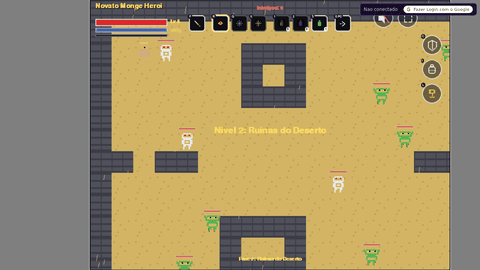
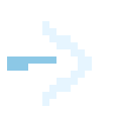
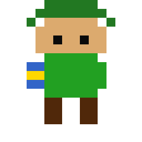

# Dungeon Quest 🗡️

[](LICENSE)
[](https://github.com/gsbad/dungeon-quest/actions/workflows/deploy.yml)

[](https://129.80.222.127.sslip.io)

Um action-RPG 2D top-down estilo Zelda, feito em Python com pygame — projeto indie pessoal, sem dependências de assets externos (todo sprite é pixel art gerada em código). Roda no navegador (PC e celular) e é jogável agora em **https://129.80.222.127.sslip.io**.



---

## 🕹️ Sobre o jogo

Uma campanha em **3 atos** (13 fases, incluindo uma secreta), com sistema de atributos/profissões estilo Ultima Online, magias, itens, clima dinâmico, afixos de monstro (Paragon/Campeão), 5 níveis de dificuldade e um Bestiário/Atlas pra acompanhar o que já foi descoberto.

### Destaques

- **3 atos, 4 bosses únicos** — cada um com sprite, sala e padrão de ataque próprios (Senhor da Guerra Orc, Necromante, Rei das Sombras, e o Cacodemônio da fase secreta).
- **20 arquétipos de monstro comuns**, cada um com seu próprio rig visual e "magia"/ataque de acordo com a natureza dele (veneno, gelo, choque, fogo, fraqueza...), espalhados pelas 12 fases de combate.
- **Atributos e profissões**: FOR/DES/INT/SAB/VIG/SOR determinam 16 profissões possíveis (5 puras + 10 híbridas + Aventureiro), sem nada "guardado" — é só a leitura dos pontos gastos.
- **Combate mirado no mouse (PC) / toque-e-arraste (celular)**: ataque corpo a corpo, Bola de Fogo, Nova de Gelo e a Investida (Dash) seguem a direção real do cursor/arraste, não só 4 direções fixas. Recuo físico (knockback) em todo dano recebido, e herói/monstro nunca ocupam o mesmo espaço.
- **Dash**: mobilidade baseada em Destreza, dano de contato, e um rastro fantasma que se apaga atrás do herói.
- **Posturas**: cada uma das 15 profissões (5 puras + 10 híbridas) ganha um bônus permanente próprio — dano, defesa, velocidade, regeneração — só por estar naquela profissão, sem gasto extra.
- **Masmorra com chave escondida**: a saída de cada fase é um baú trancado — cave com a Picareta (bloco por bloco, 2 golpes cada) até achar a chave enterrada num ponto do mapa. Blocos quebrados podem soltar poções/vida/mana; monstros voltam aos poucos depois que a sala é limpa.
- **Magias**: Bola de Fogo, Nova de Gelo, Luz Curativa — desbloqueadas por requisito de atributo.
- **~25 poções e elixires**, cada um com um buff temporário próprio (dano, defesa, regeneração, XP, ouro...) — até 3 selecionáveis para o hotbar.
- **Status effects**: Veneno, Lentidão, Fraqueza, Fogo, Frio, Calor e Choque, com cura por Antídoto onde faz sentido; números de dano flutuantes (físico/mágico/dano-ao-longo-do-tempo) em todo acerto.
- **5 dificuldades** (Normal → Inferno), cada uma a mesma campanha com monstros mais fortes, chance de Campeões, afixos de fase inteira e enrage de boss mais cedo — desbloqueadas sequencialmente.
- **Paragon**: spawn raro (3%, com pity) de monstro comum upgradado, x4 XP/ouro.
- **Clima dinâmico** por fase (neblina, chuva, neve, tempestade, cinzas...).
- **Remapeamento de teclas**: qualquer tecla de ação (ataque, magias, dash, picareta, atalhos de menu) pode ser trocada pelo próprio jogador, pelo botão de engrenagem.
- **Paperdoll** com 6 abas: Status, Magias, Bestiário, Atlas, Conquistas e Ajuda (com listagem ilustrada de debuffs, buffs de poção e posturas, além dos atalhos de teclado — sempre refletindo o remapeamento atual).
- **Leaderboard online** (requer login Google) — ranking por Nível, Horas Jogadas, Conquistas ou Ouro.
- **God mode de debug vira Super Sayajin** 🐉 — easter egg visual, não só um flag invisível.
- **Save/load** persistente, local e (opcionalmente) sincronizado na nuvem via login Google.
- **Painel de debug** (`F1`, PC apenas) pra testar atributos, economia, dificuldade, status effects, posturas e clima sem precisar re-jogar a campanha inteira.
- **Painel de balanceamento admin** (`/admin`, backend) organizado em abas por categoria (Monstros/Magias/Itens/Buffs/Debuffs/Posturas/Dificuldade), com um editor de pixel real (grade 16x16, clique/arraste) pra sobrescrever a aparência de qualquer monstro/item sem precisar editar código.
- Roda no navegador (PC e celular, via Pygbag/WebAssembly) — deploy automático via GitHub Actions a cada push em `main` (ver [`docs/deploy.md`](docs/deploy.md)).

---

## 🎮 Controles

| Tecla | Ação |
|---|---|
| W / A / S / D ou ↑↓←→ | Mover personagem |
| Mouse | Mirar ataque/magias na direção do cursor |
| ESPAÇO | Atacar corpo a corpo |
| F | Conjurar Bola de Fogo |
| Q | Conjurar Nova de Gelo |
| R | Conjurar Luz Curativa (ou Reiniciar, na tela de pausa/morte) |
| X | Investida (Dash) |
| E | Picareta — quebra blocos e cava em busca da chave escondida da masmorra |
| 1 / 2 / 3 | Usar item (slots do hotbar, escolhidos no menu Itens) |
| H (no menu Itens) | Marcar/desmarcar item para o hotbar (máx. 3) |
| C | Abrir Paperdoll (Status/Magias/Bestiário/Atlas/Conquistas/Ajuda) |
| I | Abrir Itens |
| L | Abrir Ranking (requer login Google) |
| Ícone de engrenagem | Configurações — remapear qualquer tecla de ação acima (PC, só pelo mouse/toque) |
| ESC / clique fora do painel | Pausar / fechar o menu aberto |
| ENTER | Confirmar menus |
| F1 | Painel de debug (dev, só PC) |
| F11 / F12 | Tela cheia / mudo |

Todas as teclas de ação (ataque, magias, dash, picareta, atalhos de menu) podem ser remapeadas individualmente pelo botão de engrenagem — a tabela acima mostra os padrões.

No navegador/celular, assim que a tela é tocada aparecem controles virtuais: joystick (mover), botão de ataque e magias (toque e arraste para mirar, dispara automaticamente enquanto segurar), botões de item, e um botão de pausa. (Dash/Picareta/remapeamento são PC-only por enquanto.)

---

## 🏰 Campanha

| Fase | Título | Tipo | Monstros / Boss | ML |
|---|---|---|---|---|
| 1 | Floresta Encantada | combate | esqueleto, goblin | 1 |
| 2 | Ruínas do Deserto | combate | esqueleto, goblin | 4 |
| 3 | Masmorra das Sombras | combate | esqueleto, goblin, cavaleiro negro | 8 |
| 4 | Acampamento de Guerra | **boss** | Senhor da Guerra Orc | — |
| 5 | Pântano Sombrio | combate | aranha, serpente, treant | 12 |
| 6 | Torre Amaldiçoada | combate | esqueleto, troll, cavaleiro da morte | 16 |
| 7 | Cripta Perdida | combate | zumbi, verme, imp | 20 |
| 8 | Cripta do Necromante | **boss** | Necromante | — |
| 9 | Salão dos Ecos | combate | dark horse, acólito, feiticeira | 24 |
| 10 | Abismo de Cinzas | combate | fire hound, ogro, elemental de pedra | 28 |
| 11 | Corredor Final | combate | quimera, lyzardman, esqueleto sombrio | 32 |
| 12 | Trono das Trevas | **boss** (final da campanha) | Rei das Sombras | — |
| 13 | Fase Secreta: INFERNO | **boss** (desbloqueada após vencer o Inferno) | Cacodemônio | — |

### Condição de vitória
Derrotar o **Rei das Sombras** na Fase 12 (a fase secreta é um bônus pós-campanha).

### Condição de derrota
O jogador perde toda a vida (6 corações).

Detalhes de balanceamento, fórmulas e decisões de design ficam em [`docs/design.md`](docs/design.md) — documento vivo, atualizado a cada mudança de sistema.

---

## ▶ Como Executar (Modo Desenvolvimento)

```bash
pip install pygame
python main.py
```

---

## 🌐 Como Executar no Navegador (PC e Celular)

O jogo também roda no navegador via [Pygbag](https://github.com/pygame-web/pygbag)
(compila o Pygame para WebAssembly), sem precisar instalar nada além do Python no
computador que serve o jogo.

```bash
pip install pygbag

# Terminal 1 - para abrir no navegador do próprio PC
python -m pygbag --bind localhost --port 8000 main.py

# Terminal 2 - para abrir no celular (rode em paralelo, IP diferente, porta diferente)
python -m pygbag --bind <IP-do-PC-na-rede> --port 8001 main.py
```

- No **PC**, abra `http://localhost:8000`.
- No **celular**, conecte-o na mesma rede Wi-Fi do PC e abra
  `http://<IP-do-PC-na-rede>:8001` (descubra o IP com `ipconfig` no Windows ou
  `ip addr` no Linux/WSL). **Atenção à porta:** é **8001**, não 8000 — só a
  8000 tem bind em `localhost`, a 8001 é a única que aceita conexão de outros
  dispositivos na rede. (Testamos usar 8080 no lugar de 8001 para reduzir essa
  confusão, mas nessa rede especificamente 8080 deu "connection refused" no
  celular enquanto 8001 funciona — provavelmente uma regra de firewall do
  Windows já liberada para 8001 e não para 8080 — por isso voltamos pra 8001.)
- **Por que dois processos em portas diferentes, e não um só?** O servidor de
  desenvolvimento do Pygbag copia literalmente o valor de `--bind` para dentro
  da página (para montar a URL do runtime/CDN), então só existe UM endereço
  válido por processo. `--bind 0.0.0.0` quebra tudo (gera a URL inválida
  `http://0.0.0.0:8000/...`, que o navegador recusa). E mesmo usando o IP real
  da rede num único processo, se o PC que roda o servidor for uma máquina
  WSL/Windows, o próprio PC pode não conseguir se conectar nesse IP (timeout),
  mesmo o `ping` funcionando e o celular acessando normalmente — isso é uma
  limitação de rede do WSL2 (o tráfego TCP do Windows para o IP dele mesmo,
  exposto pelo WSL, precisa de um "hairpin" que nem sempre funciona; o `ping`
  usa um caminho diferente que não depende disso, e o celular funciona porque
  chega genuinamente pela rede Wi-Fi). Rodando dois processos — um em
  `localhost` para o PC, outro no IP da rede para o celular — cada dispositivo
  usa o caminho de rede que realmente funciona para ele.
- Depois que a página carregar, **clique/toque uma vez em qualquer lugar da
  tela**: os navegadores exigem esse gesto do usuário antes de liberar áudio/o
  jogo (mensagem "Ready to start! Please click/touch page").
- **Controles no celular:** assim que qualquer toque/clique é detectado, aparecem
  controles virtuais na tela — um joystick analógico (canto inferior esquerdo)
  para mover o personagem, um botão de ataque e um arco de 3 botões de magia
  (canto inferior direito - toque e arraste para mirar, dispara automaticamente
  enquanto segurar, respeitando o cooldown), uma fileira de botões de item, e
  um botão de pausa (canto superior direito). Nos menus, basta tocar
  diretamente nas opções de texto, ou tocar fora do painel para fechá-lo. No
  navegador do PC os controles de teclado/mouse continuam funcionando
  normalmente (os virtuais só aparecem se você usar toque).
- A primeira execução baixa o runtime do Pygbag (Pyodide); é necessário ter internet
  nesse primeiro build.

---

## 🏗️ Arquitetura

O jogo roda inteiramente no cliente (nenhuma chamada de rede no caminho crítico de jogar); um backend FastAPI opcional cuida só de login/sync de save/leaderboard, hospedado numa VM Oracle Cloud com deploy automático via GitHub Actions. Visão detalhada de módulos, fluxo de dados e a decisão de ser offline-first em [`docs/architecture.md`](docs/architecture.md); passo a passo de deploy/CI em [`docs/deploy.md`](docs/deploy.md). Modo cooperativo ainda não existe — [`docs/coop-feasibility.md`](docs/coop-feasibility.md) é um estudo de viabilidade (arquitetura recomendada, o que mudaria, estimativa de esforço), não uma feature implementada.

---

## 🎨 Iconografia

Todo ícone abaixo é pixel art gerada em código (`game/assets.py`), sem nenhum arquivo de imagem externo:

| | | | |
|---|---|---|---|
|  Veneno |  Lentidão |  Fraqueza |  Fogo |
|  Frio |  Calor |  Choque |  Investida (Dash) |

E o easter egg do god mode de debug — sprite normal vs. "Super Sayajin":

<p>
  
  
</p>

---

## 📁 Estrutura do Projeto

```
dungeon-quest/
├── main.py                  ← Ponto de entrada
├── requirements.txt
├── README.md
├── LICENSE
├── CONTRIBUTING.md
├── .github/
│   └── workflows/
│       └── deploy.yml        ← CI/CD: build + deploy automático a cada push em main
├── docs/
│   ├── architecture.md        ← Visão geral de módulos/fluxo de dados/deploy (onboarding)
│   ├── design.md               ← Documento vivo de design/balanceamento
│   ├── deploy.md                 ← Deploy manual + CI/CD + acesso à VM
│   ├── save-schema.md             ← Formato do arquivo de save
│   └── assets/                     ← Ícones/GIFs renderizados para esta documentação
├── tools/
│   └── balance_sim.py               ← Simulador headless de curva de XP/combate
├── backend/                          ← FastAPI: login Google, sync de save, leaderboard, painel admin
│   ├── app/
│   │   ├── main.py
│   │   └── models.py
│   └── requirements.txt
└── game/
    ├── states.py             ← Menu, Gameplay, GameOver, Vitória
    ├── player.py             ← Personagem jogável (ataque/dash/magias/hotbar)
    ├── enemy.py               ← Inimigos comuns (IA, ataques, status effects)
    ├── boss.py                ← Bosses (fases, padrões de ataque, projéteis)
    ├── level.py                ← Mapas e carregamento de fases (LEVEL_MAPS)
    ├── stats.py                ← StatBlock, arquétipos, fórmulas de dano/XP
    ├── status_effects.py        ← Debuffs + buffs de poção/elixir (StatusEffectCarrier, ~29 efeitos)
    ├── stances.py                ← Posturas: bônus permanente por profissão (15 entradas)
    ├── keybinds.py                 ← Teclas remapeáveis (padrões + bindings ao vivo)
    ├── settings_overlay.py          ← UI de remapeamento de teclas
    ├── appearance_overrides.py       ← Overrides de sprite vindos do editor de pixel admin
    ├── affixes.py                     ← Paragon/Campeão e afixos de fase
    ├── difficulty.py                   ← 5 tiers de dificuldade
    ├── professions.py                   ← Derivação de profissão a partir dos atributos
    ├── spells.py                         ← Magias do jogador
    ├── items.py                           ← Poções/elixires/consumíveis (~25 itens)
    ├── merchant.py                         ← Loja + seleção de hotbar (menu Itens)
    ├── weather.py                           ← Clima dinâmico por fase
    ├── reputation.py                         ← Reputação/facções
    ├── bestiary.py                            ← Dados do Bestiário (nome/descrição/discovery)
    ├── leaderboard.py                          ← Overlay + busca do ranking online
    ├── balance_config.py                        ← Aplica overrides vindos do painel admin
    ├── net.py                                     ← Ponte pyodide/emscripten para o backend
    ├── paperdoll.py                                ← UI do painel do personagem (6 abas)
    ├── debug_panel.py                               ← Painel de debug (F1)
    ├── save.py                                       ← Persistência (save/load)
    ├── camera.py                                      ← Câmera suave
    ├── audio.py                                        ← Som
    ├── input_system.py                                  ← Teclado/mouse/touch unificados
    ├── combat_fx.py                                       ← Números de dano flutuantes + knockback
    ├── theme.py                                            ← Paleta de cores e fontes
    ├── ui.py                                                ← Componentes de UI reutilizáveis
    └── assets.py                                             ← Sprites/ícones pixel art gerados em código
```

---

*Todos os sprites são gerados programaticamente em código Python puro (sem arquivos externos de imagem), garantindo portabilidade total.*
